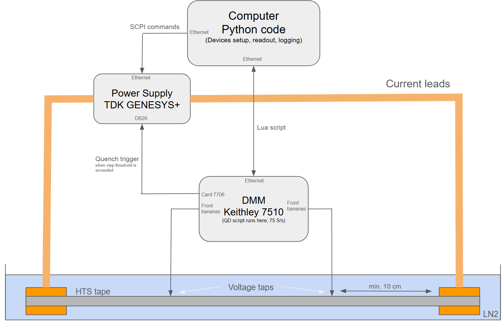
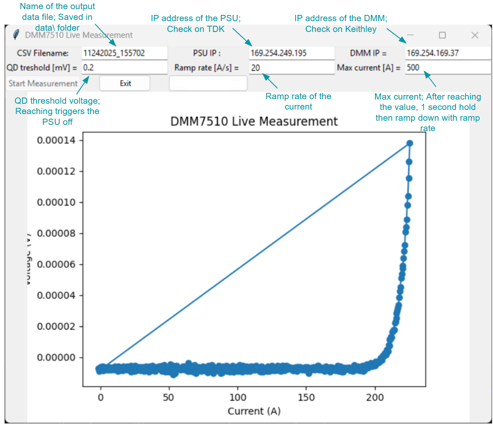

# Tape measurement testbench software

A simple quench detection system for measuring superconducting parameters of HTS tapes.

## Overview

- **Python Script (running on the computer)**
  - Configures all connected devices based on user interface settings
  - Uploads and executes the Lua script on the Keithley DMM
  - Sends SCPI commands to the TDK power supply to initiate the current ramp-up
  - Collects timestamp, current, and voltage data from the DMM and stores it as a `.csv` file in the `data/` folder
    - The current value is interpolated from the timestamp

- **Keithley 7510 Digital Multimeter:**
  - Runs the Lua script locally on the device
  - Measures the voltage taps at a sampling rate of 75 Samples/s
  - If voltage exceeds the QD_treshold, it triggers an interlock signal via the GPIO using the 7706 card

- **TDK Genesys+ Power Supply**
  - Receives SCPI commands from the Python script
  - Performs the a current ramp
  - If an interlock signal is received thourg the DB26 connector, it immediately shuts off the current

### Measurement Setup:


## Manual

##### Creating a virtual environemnt
```
python -m venv dmm_env
dmm_env\Scripts\activate      # Windows
```
##### Installing dependecies
```
pip install pyvisa
pip install pyvisa-py
pip install matplotlib
pip install tk
pip install numpy
```

#### Running the code
`python.exe .\QD_ui.py`

#### Compile the .exe file
`pyinstaller --onefile --hidden-import TDK_PSU_Control --paths=. QD_ui.py  `

#### Files

`QD.tsp` - Lua script for Keithely 7510 DMM
`TDK_PSU_Control.py` - Python code for controlling TDK Genesys+ power supply
`QD_ui.py` - User interface running on PC

### User interface:

